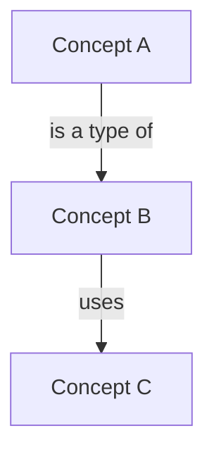

# Concept Diagram Guide (Mermaid)

`output/draft/concept-diagram.mmd` must be a valid Mermaid `flowchart TD`.

## Hard rules

- **Node count:** maximum ~15 nodes — one node per key concept from
  `output/draft/key-concepts.md`.
- **Node IDs:** kebab-case (e.g., `problem-solving-agents`). Node labels
  are human-readable titles in square brackets.
- **Edges:** only relationships stated in the source. Label every edge
  with the relationship in quotes, e.g. `A -->|"depends on"| B`.
- **No invention:** do not add nodes or edges for concepts or
  relationships that are not in the extraction.
- **Layout:** top-down (`TD`). Use subgraphs only when the source
  explicitly groups concepts.

## Skeleton



## Validation checklist

- [ ] `flowchart TD` header present
- [ ] 15 or fewer nodes
- [ ] all node IDs kebab-case and unique
- [ ] every edge labeled
- [ ] brackets balanced; every node ID defined before first use
- [ ] node set matches `key-concepts.md` (none extra, none missing)

## Rendering (optional visual check)

If the Mermaid CLI is available:

```powershell
cmd /c "npx -y @mermaid-js/mermaid-cli -i output\draft\concept-diagram.mmd -o output\draft\concept-diagram.png"
```

Otherwise verify the syntax structurally (checklist above) and paste the
file into https://mermaid.live for a render check.
